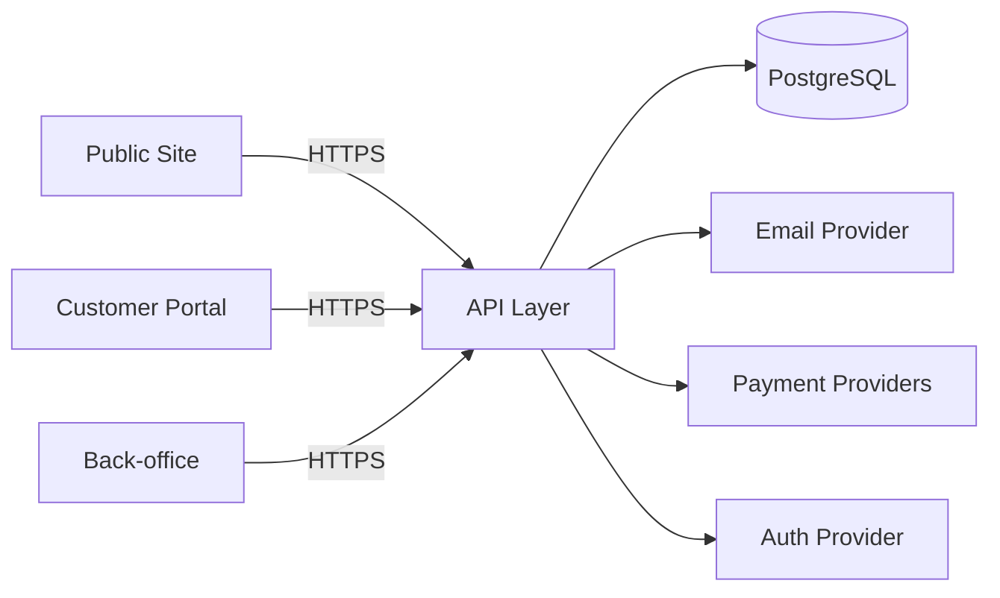

# System Design (SPA Booking Web)

## 1. Scope
Describe the technical system design for the SPA booking and management web app.

## 2. High-Level Architecture
- Public site + customer account (Next.js)
- Back-office admin portal (Next.js)
- API layer (Next.js Route Handlers / Server Actions)
- PostgreSQL database (Neon)
- ORM: Prisma
- Auth provider (customers + staff)
- Email notification service (MVP)
- Payment providers (VNPay, Momo, Stripe)
- Locale routing handled by `/[locale]` segments (middleware disabled temporarily).
- Root path `/` rewrites to `/en` at the edge (vercel.json) while middleware is disabled.

### 2.1 Codebase Structure (App Router)
- Separate route groups for `public` and `admin` experiences:
  - `src/app/(public)/` → public marketing + customer flows
  - `src/app/(admin)/` → back-office admin portal
- Shared UI modules under:
  - `src/modules/shared/` (design system, layout primitives)
  - `src/modules/public/` and `src/modules/admin/` for feature components
  - Admin URL prefix: `/[locale]/admin`

## 3. Runtime Topology

## 4. Data Flow
- Server Components load public pages and service data.
- Booking creates `booking` with status `pending` before payment confirmation.
- Public booking submission persists to DB and surfaces in admin dashboard.
- Public booking flow loads therapists filtered by branch/service from DB.
- Payment flow: create payment intent → verify callback → update booking/payment status.
- Admin assigns staff/time and resolves conflicts.
- Email notifications: confirmation + reminders scheduled from booking lifecycle.
- Admin dashboard reads from `/api/admin/dashboard` (DB-backed metrics + session user).
- Admin user management uses DB-backed CRUD via `/api/admin/users`.
- Core data persisted in Postgres: branches, services, and bookings (with booking-services join).

## 5. Security
- RBAC for staff (Admin/Receptionist/Staff).
- Customer auth for booking management.
- Data privacy controls and audit trail for booking edits.
- Anti-spam measures for public booking.
- Admin routes under `/[locale]/admin` are protected by layout guard using NextAuth session.
- Credentials auth (email/password, bcrypt) with role check for staff accounts.
- Google OAuth is supported for customer sign-in.
- Role is sourced from the `User.role` field.
- User status controls access (active/disabled).

## 6. Observability
- Structured logs for API requests, payments, and email notifications.
- Error tracking for failed payments and reminders.
- Metrics: booking conversion, cancellation rate, payment success rate.
