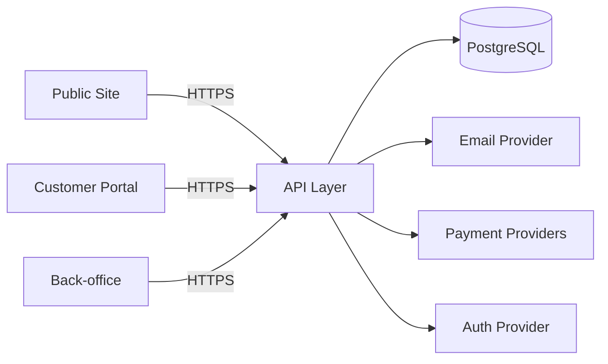

# Thiết kế hệ thống (Web đặt lịch SPA)

## 1. Phạm vi
Mô tả thiết kế hệ thống kỹ thuật cho web đặt lịch và quản lý SPA.

## 2. Kiến trúc tổng quan
- Public site + customer account (Next.js)
- Back-office admin portal (Next.js)
- Tầng API (Next.js Route Handlers / Server Actions)
- PostgreSQL database (Neon)
- ORM: Prisma
- Auth provider (khách hàng + nhân viên)
- Dịch vụ email notification (MVP)
- Payment providers (VNPay, Momo, Stripe)
- Route locale xử lý bằng segment `/[locale]` (tạm tắt middleware).
- Đường dẫn `/` được rewrite về `/en` (vercel.json) khi middleware đang tắt.

### 2.1 Cấu trúc code (App Router)
- Tách route group cho `public` và `admin`:
  - `src/app/(public)/` → trang public + luồng khách hàng
  - `src/app/(admin)/` → cổng quản trị
- Module dùng chung:
  - `src/modules/shared/` (design system, layout primitives)
  - `src/modules/public/` và `src/modules/admin/` cho component theo miền
  - Tiền tố URL admin: `/[locale]/admin`

## 3. Sơ đồ runtime

## 4. Luồng dữ liệu
- Server Components tải trang public và dữ liệu dịch vụ.
- Booking tạo `booking` trạng thái `pending` trước khi xác nhận thanh toán.
- Booking public lưu DB và hiển thị ở dashboard admin.
- Flow booking public load therapist theo chi nhánh/dịch vụ từ DB.
- Thanh toán: tạo intent → verify callback → cập nhật trạng thái booking/payment.
- Admin gán nhân viên/giờ và xử lý xung đột.
- Email notifications: xác nhận + nhắc lịch theo lifecycle.
- Dashboard admin lấy dữ liệu từ `/api/admin/dashboard` (DB metrics + user session).
- Quản lý user admin dùng CRUD DB qua `/api/admin/users`.
- Dữ liệu core lưu trong Postgres: chi nhánh, dịch vụ, booking (kèm bảng nối booking_services).

## 5. Bảo mật
- RBAC cho nhân viên (Admin/Receptionist/Staff).
- Auth cho khách hàng để quản lý booking.
- Bảo vệ dữ liệu cá nhân và audit trail cho thay đổi booking.
- Chống spam cho booking công khai.
- Route admin dưới `/[locale]/admin` được bảo vệ bởi layout guard dùng NextAuth session.
- Credentials auth (email/password, bcrypt) kèm kiểm tra role cho tài khoản nhân viên.
- Hỗ trợ Google OAuth cho đăng nhập khách hàng.
- Role lấy từ trường `User.role`.
- Trạng thái user (active/disabled) quyết định quyền truy cập.

## 6. Quan sát hệ thống
- Log có cấu trúc cho API, thanh toán, email notifications.
- Theo dõi lỗi payment/reminder.
- Metrics: conversion booking, tỷ lệ hủy, tỷ lệ thanh toán thành công.
